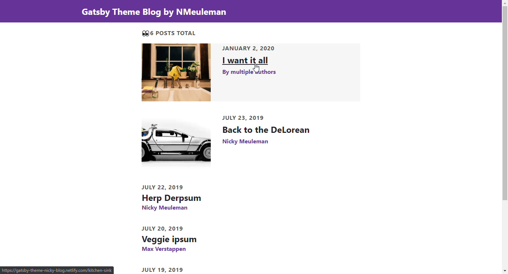
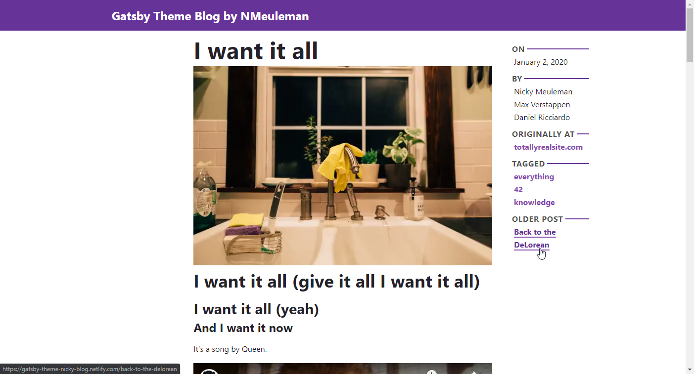

# @nickymeuleman/Gatsby Theme Blog

A Gatsby theme for creating a blog.
Check out [the live demo](https://gatsby-theme-nicky-blog.netlify.com/).

The default styling for the list of blogposts looks like this:



And the default styling for a single blogpost:



The [lighthouse](https://developers.google.com/web/tools/lighthouse/v3/scoring) score for most pages looks like this:


## What you get from this theme

- A plug and play feature rich blog platform

## Installation

To use this theme in your Gatsby sites:

1.  Install the theme

    ```sh
    npm install --save @nickymeuleman/gatsby-theme-blog
    ```

1.  Add the theme to your `gatsby-config.js`:

    ```js
    module.exports = {
      plugins: ["@nickymeuleman/gatsby-theme-blog"],
    };
    ```

1.  Start your site

    ```sh
    gatsby develop
    ```

1.  Add an `authors` file and create a post! [Instructions/details in the Usage section](#usage)

## Usage

### Theme options

| Key                   | Default value                               | Description                                                                                  |
| --------------------- | ------------------------------------------- | -------------------------------------------------------------------------------------------- |
| `assetPath`           | `"data/assets"`                             | Folder location to house extra assets (like the [author](#anatomy-of-an-authors-file) file.) |
| `instances`           | See [`instance` options](#instance-options) | Array of [`instance` options objects](#instance-options)                                     |
| `gatsbyRemarkPlugins` | `[]`                                        | Additional plugins array to be used by `gatsby-plugin-mdx`                                   |
| `remarkPlugins`       | `[]`                                        | Additional plugins array to be used by `gatsby-plugin-mdx`                                   |
| `rehypePlugins`       | `[]`                                        | Additional plugins array to be used by `gatsby-plugin-mdx`                                   |

This theme uses [`gatsby-plugin-mdx`](https://github.com/gatsbyjs/gatsby/tree/master/packages/gatsby-plugin-mdx) and allows you to customize some configuration that it uses via the `gatsbyRemarkPlugins`, `remarkPlugins`, and `rehypePlugins` options.
Those options take an array of the relevant plugins to be used.
For more information on how to use those options,
see the documentation in [`gatsby-plugin-mdx`](https://github.com/gatsbyjs/gatsby/tree/master/packages/gatsby-plugin-mdx).

#### `instance` options

| Key           | Default value  | Description                                                        |
| ------------- | -------------- | ------------------------------------------------------------------ |
| `basePath`    | `""`           | Root url for this instance. eg: `blog`                             |
| `contentPath` | `"data/posts"` | Folder location to house individual post-folders for this instance |
| `pagination`  | `undefined`    | Optional object, enables pagination if provided                    |

##### `pagination` options

| Key            | Default value | Description                                                                         |
| -------------- | ------------- | ----------------------------------------------------------------------------------- |
| `postsPerPage` | `10`          | Amount of posts per paginated page                                                  |
| `prefixPath`   | `""`          | Optional string. Prefixes numbers in the URL paths from paginated pages. eg: `page` |

### Example usage

#### Basic

```js
// gatsby-config.js
module.exports = {
  plugins: ["@nickymeuleman/gatsby-theme-blog"],
};
```

#### Advanced

```js
// gatsby-config.js
const remarkMath = require(`remark-math`);
const rehypeKatex = require(`rehype-katex`);

module.exports = {
  plugins: [
    {
      resolve: "@nickymeuleman/gatsby-theme-blog",
      options: {
        assetPath: "assets",
        instances: [
          {
            contentPath: "posts",
            basePath: "blog",
            pagination: {
              postsPerPage: 10,
              prefixPath: "page",
            },
          },
          {
            contentPath: "notes",
            basePath: "notes",
          },
        ],
        remarkPlugins: [remarkMath],
        rehypePlugins: [rehypeKatex],
      },
    },
  ],
};
```

This will result in a seperate `/blog` and `/notes` path.

The posts in `/blog` will be sourced from the `posts` folder.
The posts in `/notes` will be sourced from the `notes` folder.

Only posts in `/blog` will be paginated. With each paginated page holding a maximum of 10 posts.
Paginated pages after the one that lists the first 10 posts, will be prefixed be `/page`. eg. `/blog`, `/blog/page/2`, `/blog/page/3`, etc.

Two plugins to add support for math equations via [KaTeX](https://katex.org/) are added.
Sidenote: For KaTeX to work correctly, The plugins on their own are not enough.
The CSS also has to be included on the pages equations are used, in the demo this is done in `gatsby-browser.js`.

Authors are shared between instances (be it `/blog` or `/notes`). A single author can write posts in both instances.
Refer to the [Adding authors](#Adding-authors) to see how to add authors.

### Additional configuration

In addition to the theme options, there are a handful of items you can customize via the `siteMetadata` object in your site's `gatsby-config.js`

```js
// gatsby-config.js
module.exports = {
  siteMetadata: {
    // Used for the site title, SEO, and header component title.
    title: `My Blog Title`,
    // Used for SEO
    description: `My site description...`,
    // Used for SEO and as default if an author has no twitter defined
    social: {
      twitter: `@NMeuleman`,
    },
  },
};
```

### Adding blog posts

In the folder that was created for the `contentPath` (`data/posts` by default). Create a folder to hold a blog post. Unless a [slug](#anatomy-of-a-blogpost) is provided, the title of this folder will serve as the slug for the blogpost.
Inside that folder, an `index.mdx` or `index.md` file will be the blog post itself. Along this file can be several different files specific to that blogpost (e.g. images)
If no [date](#anatomy-of-a-blogpost) is specified, the date the `.md(x)` file was created will serve as the date for the blogpost.

> NOTE: If you dislike having a folder per blogpost, loose `.md(x)` files are also supported. Place them inside the folder created for `contentPath`.
> The title of the file will then serve as the slug of the blogpost if a slug not specified in the post's [slug](#anatomy-of-a-blogpost) field.

#### Extra mdx features

This theme adds a couple of things you can do inside an `.mdx` file.
Codeblocks, obtained by surrounding a piece of code with three backticks <code>```</code> are powered by [prism-react-renderer](https://github.com/FormidableLabs/prism-react-renderer).
As a result, these codeblocks support syntax highlighting for [a range of languages](https://github.com/FormidableLabs/prism-react-renderer/blob/master/src/vendor/prism/includeLangs.js).

Highlighting specific lines is possible by passing a string to the `hl` (short for highlight-lines) attribute when writing a codeblock.
A title may also be added to the codeblock by passing a string to the `title` attribute when writing a codeblock.
Numbering lines is possible by passing a `numberLines` attribute.

The value you pass to `hl` should be understood by [node-parse-numeric-range](https://github.com/euank/node-parse-numeric-range).
If passing a value to `numberLines`, it should be either `true` (to start the numbering at 1), or a decimal integer (to start the numbering at that number).

The code below will highlight the code inside as the `jsx` language, highlight lines 1,2,3, and 5, and put a small block above it displaying `src/components/CodeBlock.jsx`
The lines will be numbered starting at 1.
(Omit the `#` in front of these lines, I only used them here to make the three backticks show up).

````
# ```jsx numberLines hl=1-3,5 title=src/components/CodeBlock.jsx
# import React from 'react'
# import Highlight, { defaultProps } from 'prism-react-renderer'
#
# export default ({ children, className }) => {
#   const language = className.replace(/language-/, '') || ""
#   return (
#     <Highlight {...defaultProps}
#       code={children}
#       language={language}
#     >
#       {({ className, style, tokens, getLineProps, getTokenProps }) => (
#         <pre className={className} style={{ ...style }}>
#           {tokens.map((line, index) => {
#             const lineProps = getLineProps({ line, key: index })
#             return (
#               <div key={index} {...lineProps}>
#                 {line.map((token, key) => (
#                   <span key={key}{...getTokenProps({ token, key })} />
#                 ))}
#               </div>
#             )
#           }
#           )}
#         </pre>
#       )}
#     </Highlight>
#   )
# }
# ```
````

### Example folder tree

An example folder tree for this theme with the default options:

<!-- prettier-ignore-start -->
```
.
└── data
    ├── assets
    │   ├── authors.json
    │   └── image-used-often.jpg
    └── posts
        ├── my-first-post
        │   ├── index.mdx
        │   ├── coverPhoto.jpg
        │   ├── boop.png
        │   └── infinite-boop.gif
        └── my-second-post
            ├── index.md
            ├── f1-car.jpg
            └── speed-data.svg
```
<!-- 
# data
## assets
### authors.json 
### image-used-often.jpg
## posts
### my-first-post
#### index.mdx
#### coverPhoto.jpg
#### boop.png
#### infinite-boop.gif
### my-second-post
#### index.md
#### f1-car.jpg
#### speed-data.svg
-->
<!-- prettier-ignore-end -->

### Adding authors

In the folder that was created for the `assetPath` (`data/assets` by default). Create a file called `authors.json` or `authors.yaml`. This file (or files, both formats can work together) holds an array of [author objects](#anatomy-of-an-authors-file).

### Anatomy of an authors file

An authors file contains a top level array filled with object describing individual authors.
An author can have several different field with information specific to them.

| Key         | Value  | Required | Description                                                                           |
| ----------- | ------ | -------- | ------------------------------------------------------------------------------------- |
| `shortName` | string | yes      | **Unique**, url-safe identifier for the author, used in `author` field for blog posts |
| `name`      | string | yes      | Full name eg. "Nicky Meuleman"                                                        |
| `twitter`   | string | no       | Twitter handle without @                                                              |
| `image`     | string | no       | Relative path from the authors file.                                                  |

### Anatomy of a blogpost

The blogpost itself (`.md` or `.mdx` file for now, others coming soon) can have several different fields with extra information.
In `.md` or `.mdx` files these fields are set via the frontmatter.

| Key            | Value                        | Required | Description                                                                        |
| -------------- | ---------------------------- | -------- | ---------------------------------------------------------------------------------- |
| `title`        | string                       | no       | Title of the post.                                                                 |
| `date`         | date string                  | no       | Date the post was written.                                                         |
| `updatedAt`    | date string                  | no       | Date the post was last updated.                                                    |
| `canonicalUrl` | full url string              | no       | Canonical url.                                                                     |
| `authors`      | array of `shortName` strings | no       | Authors of the post. <br/>Should not be used in combination with the `author` key. |
| `author`       | `shortName` string           | no       | Author of the post. <br/>Should not be used in combination with the `authors` key. |
| `tags`         | array of tag strings         | no       | Tags for the post.                                                                 |
| `keywords`     | array of keyword strings     | no       | Keywords for SEO.                                                                  |
| `cover`        | relative path to cover image | no       | Displayed as cover image, in social cards.                                         |
| `published`    | boolean, defaults to `true`  | no       | Include the post in production.                                                    |
| `slug`         | string                       | no       | The last part of the URL for the post.                                             |
| `series`       | string                       | no       | Name of the group/series this post is a part of.                                   |

### Components used in this theme.

Overwriting these with your own is highly encouraged. This can be done via [component shadowing](https://www.gatsbyjs.org/blog/2019-04-29-component-shadowing/).

#### Query components

These components house the Gatsby template-query.
They lightly transform that data and pass it on to the corresponsing [Page component](#page-components).
Changes to these might require changes to the corresponding [Page components](#page-components) because of that.
Location to shadow: `@nickymeuleman/gatsby-theme-blog/templates/<component-name>`

- BlogPostQuery
- BlogPostListQuery
- TagQuery
- TagListQuery
- AuthorQuery
- AuthorListQuery

#### Page components

These components render an entire page.
Each component is wrapped in the `Layout` component that centers the content and adds the `Header`.
Location to shadow: `@nickymeuleman/gatsby-theme-blog/components/<component-name>`

- BlogPostPage
- BlogPostListPage
- TagPage
- TagListPage
- AuthorPage
- AuthorListPage

#### Regular components

These components are used by the [Page components](#page-components)
Location to shadow: `@nickymeuleman/gatsby-theme-blog/components/<component-name>`

- PostCard
- PostExtra
- Pagination
- CodeBlock
- SeriesSelect

#### Mdx components

These components are usable in `.mdx` files without importing them first.

- Every component from [Gatby-mdx-embed](https://github.com/PaulieScanlon/gatsby-mdx-embed)
- Aside

To add to this list, shadow `@nickymeuleman/gatsby-theme-blog/components/mdx-components`.
Every component that is exported as a named export will be available for use in `.mdx` under that name, without importing it first.

example declaration of a `<Shia />` component

```js
// in src/@nickymeuleman/gatsby-theme-blog/components/mdx-components/index.js
import React from "react";
export * from "@nickymeuleman/gatsby-theme-blog/src/components/mdx-components/index";
const Shia = ({ children }) => (
  <p>Don't let your dreams be dreams! {children}</p>
);
export { Shia };
```

example usage in an `.mdx` file

```
# Shia LaBeouf says:

<Shia>
  Just do it!
</Shia>
```

#### List of layout style related components

- Header
- layout
- Main

#### How to shadow components

If you want to use [component shadowing](https://www.gatsbyjs.org/blog/2019-04-29-component-shadowing/), create a file at the following path in your site:

```
src/@nickymeuleman/gatsby-theme-blog/components/<component-name>.js
```

#### Example usage in MDX

In any MDX blogpost:

<!-- prettier-ignore-start -->
```mdx
import { ComponentName } from "@nickymeuleman/gatsby-theme-blog"
---
<frontmatter-fields>
---

# Lorem Ipsum
<ComponentName />
```
<!-- prettier-ignore-end -->

> Components from [Gatby-mdx-embed](https://github.com/PaulieScanlon/gatsby-mdx-embed) can be used without first importing them

#### Example usage in React components

In any React component:

```jsx
import React from "react";
import { ComponentName } from "@nickymeuleman/gatsby-theme-blog";

export default () => (
  <div>
    <ComponentName />
  </div>
);
```

### Styling

This theme uses [theme-ui](https://theme-ui.com/) extensively for styling.
That means a lot of the "look" (CSS-styling) can be overridden by the user, through their own [theme-file](https://theme-ui.com/theme-spec).
To use one, export an object that adheres to [the theme-ui spec](https://theme-ui.com/theme-spec) from `src/gatsby-plugin-theme-ui/index.js`.

It is recommended that you extend [this theme's theme-ui file](https://github.com/NickyMeuleman/gatsby-theme-nicky-blog/blob/master/theme/src/gatsby-plugin-theme-ui/index.js) and add your own overrides on top.
The code below does this by merging the config used by this theme and overwriting a few `color` values that are used by this theme to make a beautiful, beautiful, website.

```js
import { themeConfig } from "@nickymeuleman/gatsby-theme-blog";
import merge from "deepmerge";

const theme = merge(themeConfig, {
  colors: {
    text: `tomato`, // the named CSS color
    mutedText: `coral`, // the named CSS color
    background: `#000`,
    mutedBackground: `rgb(50,50,50)`,
    primary: `red`, // the last entry from the array in the theme's config for "red", not raw CSS red
    mutedPrimary: `red[2]`, // the red at index 2 from the array in the theme's config for "red"
  },
});

export default theme;
```

#### Styling code blocks / syntax themes

To apply a different syntax highlighting theme to code blocks. Overwrite the styles under `styles.CodeBlock` in the theme-ui file.
To adjust the styles used for line highlighting, add new rules under `styles.CodeBlock.lineHighlight`.
To adjust the styles used for the title section of a codeblock, add new rules under `styles.CodeBlock.title`.

Various pregenerated themes are available in the [`/presets` folder of @theme-ui/prism](https://github.com/system-ui/theme-ui/tree/master/packages/prism/presets).
To use them, import your chosen theme's `.json` file, and apply it to the `styles.CodeBlock` of your theme-ui file.

The code below imports a syntax highlighting theme based on the popular [night-owl](https://marketplace.visualstudio.com/items?itemName=sdras.night-owl) by [Sarah Drasner](https://twitter.com/sarah_edo).
It also adds some styles so highlighting a line, or adding a title to the codeblock, will match the installed syntax theme.

```js
import nightOwl from "@theme-ui/prism/presets/night-owl.json";
import { themeConfig } from "@nickymeuleman/gatsby-theme-blog";
import merge from "deepmerge";

const theme = merge(themeConfig, {
  styles: {
    CodeBlock: {
      ...nightOwl,
      highlightLine: {
        backgroundColor: `#01121f`,
        borderLeftColor: `#9ccc65`,
      },
      title: {
        backgroundColor: nightOwl.backgroundColor,
        borderBottomColor: `#262a39`,
        color: nightOwl.color,
      },
    },
  },
});

export default theme;
```

### dev notes

- [ ] Multi sourcing
- [ ] 🚧 👷 revamp way slugs are handled
  - Links with a basepath broke around june 2020. Reworked to use `path.join` and force starting `/`
- [x] code blocks
  - [ ] Look into code blocks that pass contrast checks https://github.com/system-ui/theme-ui/issues/564
- [x] some light styling? (future Nicky notes: That ended up being more than light.)
  - [x] redo styles with theme-ui, like `<li>` margins?
- [ ] css reset?
- [ ] rss feed?
- [ ] offline, manifest, ...?
- [ ] icons (default icon for SEO if no fitting image found)
  - [ ] icons for tags?
  - [x] look into https://zeit.co/blog/social-og-image-cards-as-a-service
- [x] canonical url support:
  - [x] functionality works, now add docs
  - [x] add a "originally published at" line to blogpost component
- [x] multiple authors support
  - [x] multiple authors per post
  - [x] avatar for each author, because, pretty pictures are tight (watch @theryangeorge)
  - [x] rename "author" in graphql to "authors", it's an array
- [x] revamp how SEO component works
  - [x] migrate from Helmet props to nested html tags?
  - [ ] pass less props into SEO component
- [ ] Document what tasks individual components perform, how ones include others
- [x] make tags array optional
  - [x] cannot return null for non-nullable field MdxTag.id
- [x] published frontmatter field.
  - ~~[ ] option to hide unpublished articles when running "gatsby develop"?~~ hidden in blog list, individual pages exist.
- [x] different content folder for authors? (maybe together with images etc that are not directly tied to a single blogpost)
- [x] Ability to specify path in frontmatter. See: https://github.com/gatsbyjs/gatsby/pull/16611
- [x] Double images when linked like `` in mdx. Blurry and fullsize.
  - Eventual fix https://github.com/gatsbyjs/gatsby/issues/16242
  - temporary fix: add `plugins` instead of `gatsbyRemarkPlugins`
- [x] Add link icons next to headings via: https://theme-ui.com/recipes/linked-headings/
  - note: Why was this better than `gatsby-remark-autolink-headers` again? Saw it in a GitHub issue somewhere
  - https://github.com/ChristopherBiscardi/gatsby-mdx/issues/204 and https://github.com/gatsbyjs/gatsby/pull/14520
- [x] Refactor theme options to use defaults if not specified to avoid repeating yourself. See: https://github.com/gatsbyjs/gatsby/blob/master/themes/gatsby-theme-blog-core/utils/default-options.js
- [x] Make the date of blogposts default to the time the file was created in case the date frontmatter field was not specified.
- [x] Make title of blogposts default to the unkebabcased title of the folder.
- [x] Allow unkebabcased slugs in frontmatter
- [x] Allow blog posts as plain markdown/mdx files, not in a folder
- [x] document loose files as blogposts
- [x] Allow author field in frontmatter to be optional
  - [x] allow for authorless posts
- [ ] Make demo website function like a big readme.
- [ ] https://github.com/gatsbyjs/gatsby/pull/16149 got merged, use it.
- [x] https://github.com/gatsbyjs/gatsby/pull/17284 got merged, use it.
      Temp hack: add empty proxy directive: https://github.com/gatsbyjs/gatsby/issues/21476
- [x] Migrate theme to TypeScript, leave demo as JavaScript
- [x] Add testing with react-testing-library and cypress
  - [ ] Actually add tests once the scaffolding is done
  - [ ] Use something like codecov to ensure test coverage
- [ ] Social share images
      Research: - https://github.com/zeit/og-image - https://lannonbr.com/blog/2019-11-10-og-images/ - https://github.com/ChristopherBiscardi/gatsby-plugins/tree/master/packages/gatsby-plugin-printer - https://www.learnwithjason.dev/blog/auto-generate-social-image/ - https://github.com/jlengstorf/get-share-image - https://www.swyx.io/writing/jamstack-og-images/ - https://aless.co/gatsby-wasm-plugin/ - https://github.com/alessbell/gatsby-remark-twitter-cards - https://andrewingram.net/posts/automatic-social-cards-with-gatsby/ - https://github.com/syntra/gatsby-remark-social-cards > twitter card-size image (630 x 1200 px) > from: Andres Ingram link > `// Set the viewport to the desired dimensions of the image` > `await page.setViewport({ width: 2048, height: 1170 });`
      personal note: analysis paralysis is real
- [x] Components in .mdx 🚧
      Like this `<Aside>` https://github.com/jlengstorf/learnwithjason.dev/blob/master/site/src/components/aside.js
      also `<YouTube>`, `<Twitter>`, `<CodeSandbox>` etc.
      maybe use https://github.com/MichaelDeBoey/gatsby-remark-embedder for part of those embeds.
      https://github.com/PaulieScanlon/gatsby-mdx-embed is in line with original idea of creating the components myself.
      Implemented.
      Caused some issues: detailed https://github.com/PaulieScanlon/gatsby-mdx-embed/issues/11
- [x] Migrate to theme-ui v0.3
- [x] Rename Underpost to PostExtra
- [x] Rework default `contentPath` and `assetPath`
- [x] Remove duplicate remark images plugin
- [x] Page per author
- [x] Avatar support for authors
  - [ ] Use avatars in demo.
- [ ] CLI to scaffold out now blogposts (See how Kyle Shevlin does this.)
- [x] theme border values. Only take the sharp edge off, don't round too much.
- [x] add support for updating blogposts (updatedAt frontmatter field?)
- [x] Rework how cards are done `BlogList` https://inclusive-components.design/cards/
- [ ] Use [inversion of control](https://kentcdodds.com/blog/inversion-of-control/) and [component composition](https://youtu.be/3XaXKiXtNjw) more.
  - eg. Using `props.children` inside the `PostExtra` component.
- [x] Refactor all page creations to use same pattern. Query in templates/* that only renders a component named *Page. That component has the `<SEO />`
- [x] Rename all top level page components to have `Page` in their name.
- [x] Relocate `Layout` component from templates to `Page` components.
- [x] Rename all gatsby templates to have `Query` in their name. Since they are made up of a query, passing that data to a `Page` component.
- [x] Handle data in every page component the same way
- [x] Handle passing of `basePath` the same everywhere.
- [x] Sort named exports from this theme
- [x] Put theme options in a Gatsby node
      https://www.christopherbiscardi.com/post/applying-theme-options-using-custom-configuration-nodes/
  - [x] Make React hook that queries for those options and use the hook instead of passing options around in pageContext etc
- [ ] Ability to add custom OG images for pages like BlogListPage (also use the `<SEO />` `image` prop for that?)
  - [x] `type` prop for `<SEO />`? Different behavior based on type?
    - The `basePath` prop now fulfills this role.
  - [ ] refactor `Page` components so `<SEO />` can easily be swapped?
- [x] Give components a `variant` so the user can theme them via theme-ui
- [x] Fix links in headers being hidden (because of the link icon)
- [x] Table of contents
  - [x] Style active link in table of contents
    - [ ] Only run that logic on desktop and if table of contents is open
- [x] Refactor exports to be named exports as often as possible (reason: node import syntax getting closer to ESM, but only named. While not needed here because of compilation, good to be consistent everywhere, regardless of technology used.)
- [x] Refactor @theme-ui/prism to self-rolled setup of prism-react-renderer for increased flexibility.
  - [x] Add line highlighting
  - [x] Add code title support
  - [ ] document everything
- [x] Support multiple basePaths (eg `/blog`, `/notes`, and `/tips`)
  - [x] Redo theme options, users can define multiple `instances`. Some options are specific to the instance.
  - [x] Create folders based on the `contentPath`
  - [x] Support sharing authors across those multiple basePaths.
    - Moved authors page paths from `/<basepath>/author/<name>` to the top level `/author/<name>` as a result.
  - [ ] Support different `Page` components for different instances.
- [ ] PaginationContext and PageContext in BlogPostListPage are duplicated right now
- [ ] Redo how the `<SEO />` gathers information. It's becoming an a-prop-calypse in there.
- [x] Support line numbering in codeblocks
- [x] Support adding own plugins to the internal `gatsby-plugin-mdx`
